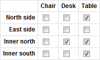

InfiniteFormBundle's CheckboxGrid Form Type
===========================================

Synopsis
-------

This:

```php
    $builder->add('productAreas', EntityCheckboxGridType::class, array(
        'class' => 'Acme\DemoBundle\Entity\SalesmanProductArea',
        'x_path' => 'productSold',
        'y_path' => 'areaServiced',
    ));
```

Becomes this:



Introduction
------------

The CheckboxGrid form type allows editing many-to-many relationships with
a grid of checkboxes. It has handy shortcuts for Doctrine entities but can
also be used with arrays of regular objects.

For example, a company might sell multiple products, and operate in
different areas. Any of its salesmen could sell any combination of products
in areas. The salesman form needs a table of checkboxes where the rows are
products and the columns are areas (or vice versa!)

Requirements and Notes
---------------------

* The CheckboxGrid type requires Symfony 2.2 or greater.
* For the entity checkbox grid, you will probably need to specify
  `cascade={"persist"}, orphanRemoval=true`. In the example below, it would
  go on Salesman::productAreas.


Installation
------------

* [Install InfiniteFormBundle](installation.md)
* Either include the default form theme (covered in the installation docs)
  or define your own

Usage
-----

A very simple example:

```php
<?php

namespace Acme\DemoBundle\Form;

use Infinite\FormBundle\Form\Type\EntityCheckboxGridType;
use Symfony\Component\Form\AbstractType;
use Symfony\Component\Form\FormBuilderInterface;
use Symfony\Component\Form\Extension\Core\Type\TextType;
use Symfony\Component\OptionsResolver\OptionsResolver;

class SalesmanType extends AbstractType
{
    public function buildForm(FormBuilderInterface $builder, array $options)
    {
        $builder->add('name', TextType::class);
        $builder->add('productAreas', EntityCheckboxGrid::class, array(
            'class' => 'Acme\DemoBundle\Entity\SalesmanProductArea',
            'x_path' => 'productSold',
            'y_path' => 'areaServiced',
        ));
    }

    public function getBlockPrefix()
    {
        return 'salesman';
    }

    public function configureOptions(OptionsResolver $resolver)
    {
        $resolver->setDefaults(array(
            'data_class' => 'Acme\DemoBundle\Entity\Salesman',
        ));
    }
}
```

Render it normally in your form and you're done! If you don't get a table of
checkboxes then make sure you're including the form theme or define your own.

This example assumed that the product and area types have a __toString. If
not, specify them with x_label_path and/or y_label_path.

The CheckboxGrid type determines automatically (from Doctrine metadata) the
types of productSold and areaServiced, then loads all of them to set the
rows and columns. You can also specify a query builder or choice list.

Finally, you can exclude checkboxes with a cell_filter closure.

An example with more options:

```php
        $builder->add('productAreas', EntityCheckboxGridType::class, array(
            'class' => 'Acme\DemoBundle\Entity\SalesmanProductArea',

            'x_path' => 'productSold',
            'x_label_path' => 'name',
            'x_query_builder' => function (EntityRepository $repo) {
                return $repo->createQueryBuilder('p')
                    ->orderBy('p.name');
            },

            'y_path' => 'areaServiced',
            'y_label_path' => 'name',
            'y_choices' => $areaChoices, // An array of options built elsewhere

            'cell_filter' => function ($x, $y) {
                // We cannot sell tables in the north due to contractual obligations
                return $x->getName() != 'Table' || $y->getName() != 'North';
            },
        ));
```

Customising the Rendering
-------------------------

The default rendering is a plain table. Maybe it needs classes to match your
CSS styles or you'd like to add some Javascript to allow checking every box
in a row or column at once.

Open your form theme and add blocks for infinite_form_checkbox_grid_widget
and infinite_form_checkbox_row_widget. Use our [default form theme](../views/form_theme.html.twig)
as a guide for what to put there.

See [Form Theming in Twig](http://symfony.com/doc/3.1/cookbook/form/form_customization.html#form-theming-in-twig)
if you're not sure where to add the blocks.
